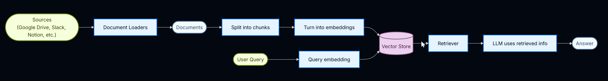
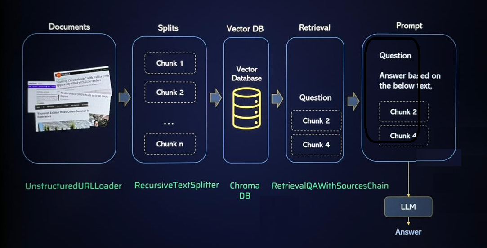

# Retrieval-Augmented Generation (RAG)
## Retrieval-Augmented Generation (RAG) ##
Retrieval-Augmented Generation (RAG) is the process of optimizing the output of a large language model, so it references an authoritative knowledge base outside of its training data sources before generating a response. Large Language Models (LLMs) are trained on vast volumes of data and use billions of parameters to generate original output for tasks like answering questions, translating languages, and completing sentences. RAG extends the already powerful capabilities of LLMs to specific domains or an organization's internal knowledge base, all without the need to retrain the model. It is a cost-effective approach to improving LLM output so it remains relevant, accurate, and useful in various contexts.

Retrieval-augmented generation (RAG) is an advanced hybrid technique or model that integrates a retrieval component within a generative model. In practice, this means that when a RAG model is prompted to generate text or answer a question, it first retrieves relevant information from a vast database. It then uses this context as a direct input to guide and inform the generative process, creating responses that are informed by specific, real-world data rather than relying solely on pretrained knowledge. 

This dynamic approach allows RAG models to produce more accurate, timely, and contextually appropriate outputs, significantly reducing the occurrence of errors and hallucinations that are typical of traditional models. is an advanced hybrid technique or model that integrates a retrieval component within a generative model. 
In practice, this means that when a RAG model is prompted to generate text or answer a question, it first retrieves relevant information from a vast database. It then uses this context as a direct input to guide and inform the generative process, creating responses that are informed by specific, real-world data rather than relying solely on pretrained knowledge.

This dynamic approach allows RAG models to produce more accurate, timely, and contextually appropriate outputs, significantly reducing the occurrence of errors and hallucinations that are typical of traditional models. 

### Initialize the project. Execute in empty directory to create the folder structure
uv init

### Create virtual environment
uv venv

or

python -m venv venv

### Activate the virtual environment
.venv\Scripts\activate

### Install the required packages
uv add -r requirements.txt

or

pip install -r requirements.txt

### Add ipykernel for Notebook (.ipynb file) 
uv add ipykernel

### References 
https://medium.com/data-and-beyond/document-loaders-in-langchain-f23d3ce70d66

https://reference.langchain.com/python/langchain-community/document_loaders 